# 毕业设计精选的基于springBoot政府管理的系统-解决毕业难题

---
### 👉作者QQ ：1556708905 微信：zheng0123Long (支持定制修改、部署调试、定制毕设)

### 👉接网站建设、小程序、H5、APP、各种系统等

---

#### 介绍

如何快速的完成毕业设计并顺利毕业呢？基于Spring Boot的政府管理系统是一款专为政府机构设计的高效管理平台，旨在通过信息化手段提升政府管理的效率和透明度。该系统具有管理员和用户两种角色，分别用于系统的全面管理和具体信息的处理与查询。系统功能涵盖基础数据管理、公文管理、会议室管理、来访管理等，确保政府工作的有序进行和信息的高效传递。

#### 研究背景

互联网概念的产生到如今的蓬勃发展，用了短短的几十年时间就风靡全球，使得全球各个行业都进行了互联网的改造升级，标志着互联网浪潮的来临。在这个新的时代，各行各业都充分考虑互联网是否能与本行业进行结合，是否能解决本行业或者本行业中某些方面的自古以来的痛点。长期以来，数据内容，数据传播，数据储存等都是一门门专业的内容，因为需要记住的内容很多，造成古人的言简意赅，如今互联网的到来让数据更加的清晰好认不复杂，一目了然不出错，毕竟在整个历史上数据的丢失，传承的断代，都是因为数据不能好好的保存，不能好好的流传。当年的年代用互联网思维和互联网技术，对大量数据的录入更新，存储汇总，备份分析方面，使得远远的超过传统的数据管理技术。在这样的时代潮流下，采用新技术开发新软件，对传统行业进行革命性的改造成为了当今的主流。本次开发政府管理系统，解决了来访登记信息管理关于数据方面的管理分析，存储传输的痛点，不仅仅对管理员提供了便利，还能提高用户的满意度。

#### 技术栈

后端技术栈：Springboot+Mysql+Maven

前端技术栈：Vue+Html+Css+Javascript+ElementUI

开发工具：Idea+Vscode+Navicate

#### 系统功能介绍

管理员角色功能模块  
个人中心：管理员可以在个人中心查看和管理个人信息，进行密码修改等操作，确保账户的安全性。  
基础数据管理：管理员可以管理系统的基础数据，包括部门信息、职位信息等，确保系统数据的准确性和完整性。  
公告管理：管理员可以发布、修改和删除公告信息，确保重要信息的及时传达和公开。  
公文管理：管理员可以管理公文的创建、审核、发布和存档，确保公文流转的高效性和规范性。  
会议室管理：管理员可以管理会议室的预订、使用和维护，确保会议室资源的合理利用。  
来访管理：管理员可以记录和管理来访人员的信息，确保来访记录的准确性和安全性。  
用户管理：管理员可以管理系统内所有用户的信息，分配权限和角色，确保系统的正常运作。  

用户角色功能模块  
个人中心：用户可以在个人中心查看和管理个人信息，进行密码修改等操作，确保账户的安全性。  
公告管理：用户可以查看系统内发布的公告信息，确保及时了解重要通知和信息。  
公文管理：用户可以查看和下载相关公文，确保工作中所需公文的及时获取和使用。  
会议室管理：用户可以预订会议室，查看会议室的使用情况，确保会议的顺利安排。  
来访管理：用户可以记录和查看来访人员的信息，确保来访记录的完整性和安全性。  

#### 功能结构设计

在管理员功能模块确定下来的基础上，对管理员各个功能进行设计，确定管理员功能的详细模块。绘制的管理员功能结构见下图。

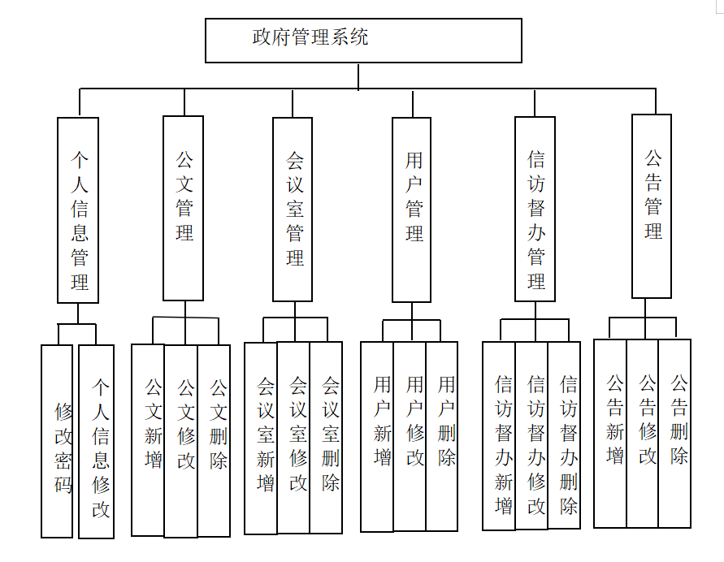

#### 系统流程分析

分析程序的流程，涉及到程序的整体操作流程，通过分析与设计，绘制的程序操作流程图见下图。此程序为了确保安全，会让使用者通过登录模块验证信息，符合要求的使用者才有权限操作程序。

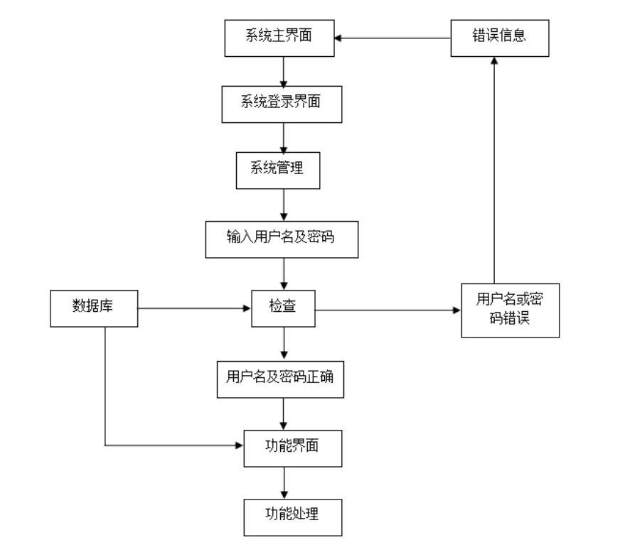

程序处理数据会涉及到数据的录入环节，绘制的添加流程见下图。程序录入数据过程中，始终与数据库保持同步

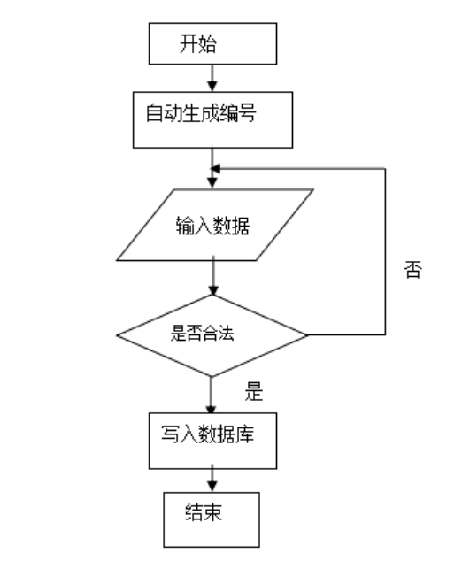

程序里面的数据也会出现错误，因此就有相应的修改数据的功能，绘制的程序修改流程见下图。此过程也是跟后台数据库进行数据同步显示。

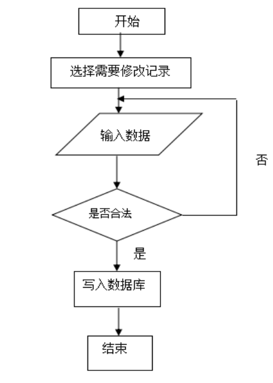

程序数据存放于数据仓库，有时也会涉及到数据删除，此过程对应的流程图见下图。数据信息被删除之后，数据库里面也就没有了该数据信息了。

#### 系统作用

基于Spring Boot的政府管理系统在现代政府管理中发挥了重要作用：

提升管理效率：通过信息化手段，实现政府管理事务的电子化和自动化，大大提高了管理效率。  
确保数据准确性：系统通过标准化的数据录入和管理流程，确保政府管理数据的准确性和一致性，为决策提供可靠依据。  
增强信息透明度：系统提供了公告管理和公文管理功能，确保重要信息的及时公开和透明。  
优化资源利用：系统通过会议室管理功能，实现了会议室资源的合理分配和高效利用。  
提高安全性：系统通过权限管理和数据加密等技术手段，确保政府管理信息的安全性和隐私保护。  

#### 系统功能截图

登录模块

基础数据管理

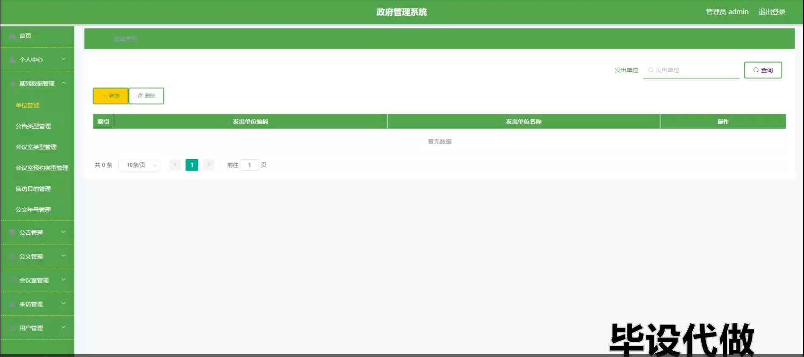

公文管理

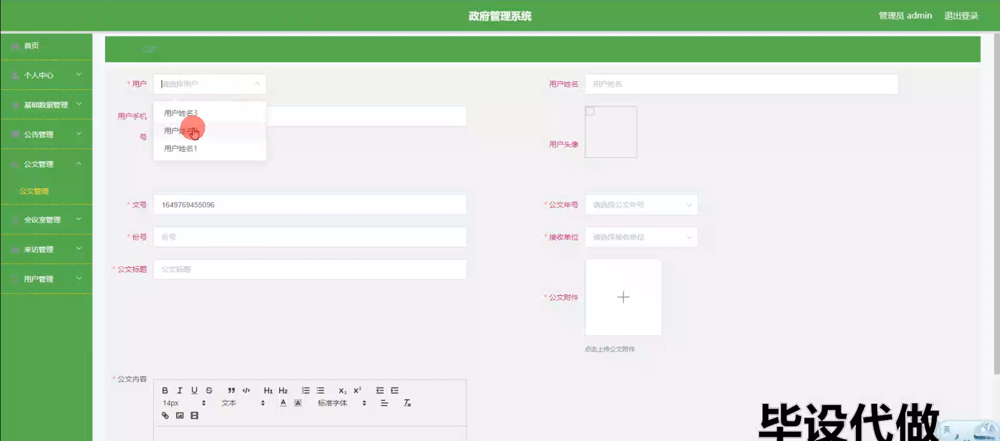

公告管理

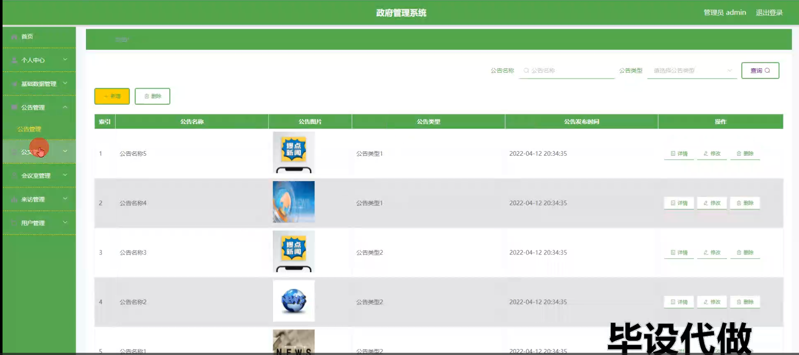

会议室管理

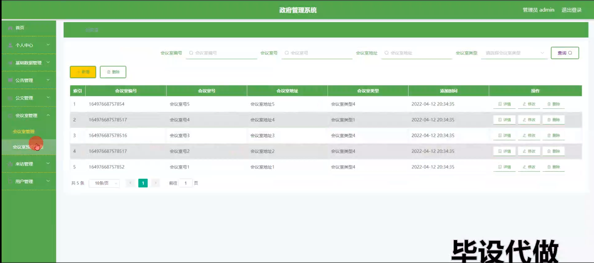

来访管理

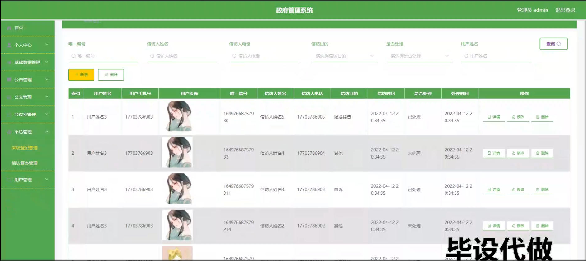

用户管理

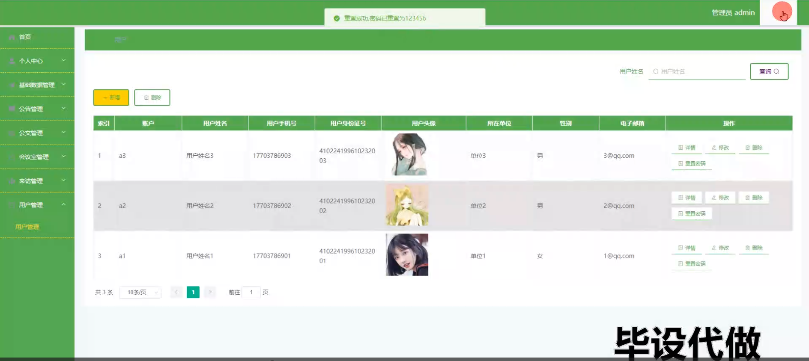

用户端公文管理

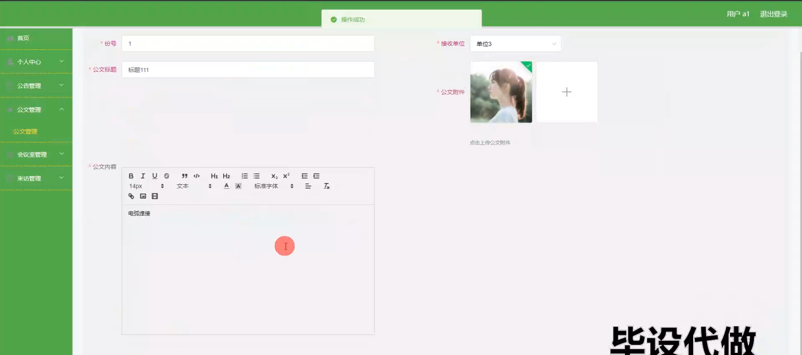

来访督办管理

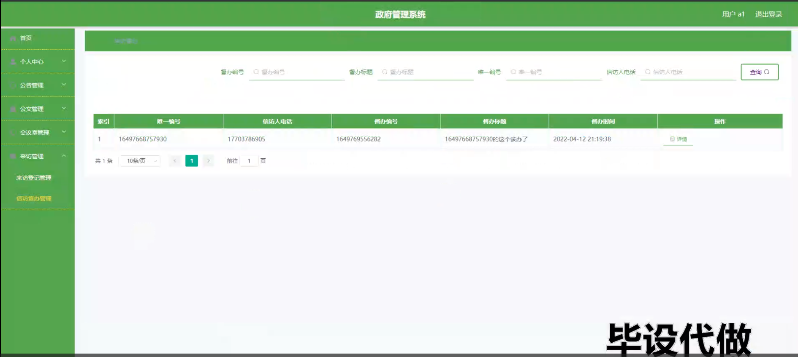

#### 总结

基于Spring Boot的政府管理系统通过全面的功能模块设计，实现了政府管理事务的高效管理和信息化支持，为现代政府办公提供了强有力的技术保障。系统在提升管理效率、确保数据准确性和增强信息透明度方面发挥了重要作用。然而，在实际应用中，系统可能还面临着扩展性和用户体验方面的挑战。未来，可以结合更多的智能技术，如大数据分析和人工智能，进一步提升系统的功能和性能，确保在应对各种政府管理事务时，能够快速、准确、高效地进行管理和决策。通过不断的优化和升级，基于Spring Boot的政府管理系统将为政府管理的发展提供更加坚实的保障。

#### 使用说明

创建数据库，执行数据库脚本 修改jdbc数据库连接参数 下载安装maven依赖jar 启动idea中的springboot项目

后台登录页面
http://localhost:8080/zhengfuguanlixitong/admin/dist/index.html

管理员				账户:admin 		密码：admin

用户				账户:a1 		密码：123456

